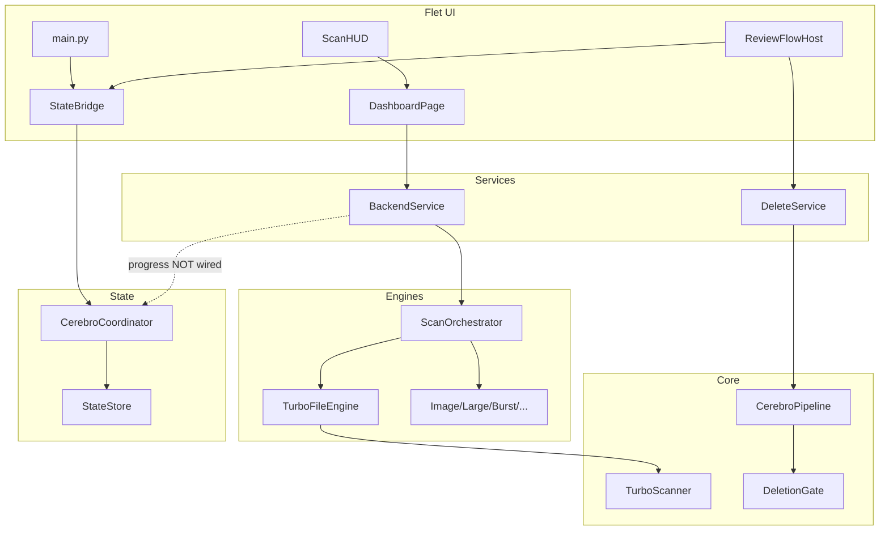

# CEREBRO (backhouse-dff) — Production Readiness Audit

**Audit date:** 2026-05-20  
**Scope:** Full codebase (`cerebro/`, `dev/`, `main.py`) — ~241 Python files, ~36.5k LOC  
**Product:** Desktop duplicate-file finder (Flet UI, local filesystem, no HTTP API)  
**Assumption:** Intended for serious production use at scale on end-user machines

---

## 1. Executive Summary

CEREBRO is a **mature desktop application** with unusually strong investment in **deletion safety**, **scan performance**, and **state management** for its category. The primary scan path (`files` → `TurboFileEngine` → `TurboScanner`) is engineered for large libraries: checkpointing, hash cache, cancel semantics, and UI progress marshaling are largely production-grade.

However, the codebase is in a **partial architectural migration** (monolithic pages → `components/` + `design_system/` + `review_flow/`). Several **non-primary scan modes** have lifecycle bugs, **v2 Redux-style state is not wired during scans**, and the Flet UI layer has **thread-safety inconsistencies** that can cause intermittent UI corruption under load.

**Verdict:** **Not production-ready for enterprise-grade, multi-mode, always-on deployment** without remediation. **Conditionally production-ready** for the **single-mode Turbo file-scan + review/delete** path on Windows/macOS after addressing Critical/High UI threading and scale limits.

**Estimated effort to enterprise-grade:** **8–14 engineer-weeks** (2 engineers × 4–7 weeks), depending on scope (UI-only hardening vs. full engine unification + observability + Windows CI).

---

## 2. Overall Production Readiness Score

| Dimension | Score (0–100) | Notes |
|-----------|---------------|-------|
| Core scan engine (Turbo/files) | **78** | Strong; scale/cancel/snapshot risks remain |
| Secondary scan modes | **35** | Orchestrator/engine threading contract broken |
| UI / Flet layer | **62** | Good patterns mixed with `run_thread` violations |
| Security (desktop threat model) | **72** | Excellent delete gate; trash path weaker |
| Testing | **70** | Deep unit tests; no E2E, Linux-only CI |
| DevOps / CI | **58** | pytest + memray; no lockfile, SCA, Windows |
| Observability | **45** | Local logs only |
| Maintainability | **55** | Partial refactor; large monoliths remain |
| UX / accessibility | **50** | Solid scan UX; a11y and browse keyboard gaps |
| **Overall** | **58 / 100** | Weighted toward primary path |

---

## 3. Critical Risks

| ID | Finding | Severity | Impact | Difficulty |
|----|---------|----------|--------|------------|
| C1 | **Non-Turbo engines return before inner scan threads finish** — `ImageDedupEngine.start()` spawns `_scan_thread` and returns; `ScanOrchestrator.wait_for_completion()` only joins orchestrator thread | **Critical** | Empty/partial results for photos, burst, empty folders, large files, similar folders | Medium |
| C2 | **Inverted pause semantics** — Turbo uses `Event.set()` = running; other engines use `is_set()` = paused | **Critical** | Pause/resume broken for non-files modes | Low–Medium |
| C3 | **`page.run_thread` used to mutate Flet controls** — `host.py` (delete progress), `state_bridge.py` (stats), `scan_hud.py` (clock tick) while codebase documents `run_task` as required | **Critical** | Intermittent blank UI, races, crashes | Low |
| C4 | **Full in-memory results + JSON snapshots** — no streaming at persistence boundary; `last.json` can grow without bound | **Critical** (at scale) | OOM, multi-GB disk, frozen restore | Hard |
| C5 | **Cancel join timeout (5s)** — orchestrator may return while daemon hash workers continue | **High→Critical** | CPU/disk after cancel; races with next scan | Medium |

---

## 4. High Priority Improvements

1. **Unify engine `start()` contract** — all engines block until scan completes on orchestrator thread OR orchestrator joins `engine._scan_thread`.
2. **Standardize pause `threading.Event` polarity** in `BaseEngine` and migrate all engines.
3. **Replace all UI mutations with `page.run_task`** (mirror `BackendService._deliver_on_ui_thread`).
4. **App shutdown lifecycle** — unsubscribe `StateBridge`, stop `TimeKeeper`, shutdown `ThumbnailCache` executor.
5. **Wire `CerebroCoordinator.scan_*` APIs** or remove dead v2 scan state to eliminate dual truth (HUD vs `StateStore`).
6. **Chunked view overflow UX** — pass `trailing_builder` when `MAX_RENDERED_GROUPS` hit; remove silent `[:1000]` fallback.
7. **Snapshot size policy** — cap groups in snapshot, summary-only mode, or streaming store for review.
8. **CI: lockfile + `pip-audit` + secret scan**; add Windows smoke job.
9. **Trash deletes through pipeline validation** (optional gate for large batches).
10. **Disable runtime auto-`pip install` in release builds** (document `CEREBRO_SKIP_AUTO_DEPS`).

---

## 5. Medium Priority Improvements

- Add `busy_timeout` to `ScanHistoryDB` (hash cache already has it).
- Register `@pytest.mark.slow` and split fast/slow CI jobs.
- Expand ruff/mypy to full `cerebro/` incrementally.
- Use review skeletons during slow `refresh()` or remove dead import.
- Consolidate `_safe_update` into `components/common/safe_controls.py`.
- Rename deprecated `glass` shim to `flat_card` / `cards`.
- Preview decode size limits before PIL/ffmpeg.
- `SECURITY.md` + vulnerability disclosure process.
- Browse keyboard focus: visual highlight + scroll-into-view.
- HMAC or schema validation for `~/.cerebro` session JSON.

---

## 6. Low Priority Improvements

- Dashboard stats skeleton on first paint.
- Onboarding colors from `ThemeTokens` not hard-coded hex.
- Remove stale orchestrator "placeholder" comments.
- PyInstaller build smoke in CI (Windows runner).
- Path redaction option in logs for shared machines.
- Document `CEREBRO_REVIEW_SIMULATE_APPLY` as debug-only.

---

## 7. Security Findings

| ID | Finding | Severity |
|----|---------|----------|
| S1 | Runtime auto-`pip install` from PyPI on source launch (`runtime_deps.py`) | High |
| S2 | Trash/managed deletes bypass `DeletionGate` (permanent path gated) | High |
| S3 | No dependency vulnerability scanning in CI | Medium |
| S4 | No secret scanning (gitleaks) in CI | Medium |
| S5 | `CEREBRO_REVIEW_SIMULATE_APPLY` can skip real deletes | Medium |
| S6 | Local JSON session/snapshot tampering (no integrity) | Medium |
| S7 | Image/ffmpeg preview decompression DoS (no size cap) | Medium |
| S8 | Managed-trash path: partial `..` sanitization | Low |

**Strengths:** `DeletionGate` with `secrets.token_urlsafe` + `compare_digest`; parameterized SQL; no `shell=True` in subprocess; symlink-aware discovery default; extension allowlist for shell open; `.env` gitignored.

---

## 8. Performance Findings

| Area | Finding | Severity |
|------|---------|----------|
| Scale | In-memory `last_groups` + full JSON snapshot write | Critical at 100k+ files |
| UI | `page.update()` on structural state changes (full tree) | Medium |
| UI | Sync `[:1000]` fallback in browse before `attach_page` | High |
| Scan | Triple threading stack (service → orchestrator → pools) | Medium |
| Scan | Multiprocessing disables cooperative pause | Medium |
| DB | `ScanHistoryDB` without `busy_timeout` under concurrent writes | Medium |
| UI | Thumbnail pool (6 workers) + LRU 384 — good but needs shutdown | Low |

**Strengths:** `ChunkedViewBuilder` with generation guards; 4 Hz progress throttle; pagination 200/page; `BackendService` UI marshaling; memray bounds test in CI.

---

## 9. Architecture Findings



- **Good:** Clear separation UI → `BackendService` → engines; deletion pipeline isolated; v2 reducer/store for app state.
- **Bad:** Coordinator scan lifecycle unused; engines inconsistent threading; v2 checkpoint imported from engine layer (layer bleed); `results_page.py` removed but tests/docs references may linger.
- **Migration state:** `design_system/`, `components/dashboard/`, `components/scan/scan_hud.py`, `review_flow/` exist; `dashboard_page.py` still ~1.8k lines.

---

## 10. UX Findings

| Finding | Severity |
|---------|----------|
| Scan HUD: strong cancel/partial/error flows | Strength |
| Review: empty states, apply sheet, undo toasts | Strength |
| Browse arrow keys update state but not UI focus | High |
| No screen-reader semantics (`ft.Semantics`) | High |
| Review skeletons imported but unused | Medium |
| Silent truncation at 1000 groups | High |
| Theme onboarding uses hard-coded colors | Low |

---

## 11. Testing & Reliability Findings

- **~88 test modules**, strong coverage: deletion gate, pipeline, turbo scan, reducer, simulation 100k groups.
- **Gaps:** No Flet E2E; no coverage.py; no `conftest.py`; Linux-only CI; timing tests may flake (`test_simulation_100k`, performance thresholds).
- **Missing integration test:** orchestrator + `ImageDedupEngine` → non-empty `get_results()` after `wait_for_completion`.
- **No test** for archive scanning despite UI option.

---

## 12. Technical Debt Assessment

| Category | Debt level | Examples |
|----------|------------|----------|
| Monoliths | High | `dashboard_page.py`, `scan_hud.py`, `host.py`, `browse.py` |
| Duplicate helpers | Medium | `_safe_update` × 4, glass naming |
| Dead/partial APIs | Medium | `CerebroCoordinator.scan_*`, unused skeletons |
| Legacy routes | Low | `results_page` removed; `ReviewFlowHost` unified |
| Engine inconsistency | High | Threading + pause contracts |
| Documentation drift | Medium | `UI_ARCHITECTURE.md` vs live `review_flow` |

---

## 13. Scalability Assessment

| Scenario | Ready? | Blocker |
|----------|--------|---------|
| 10k files, files mode | Yes | — |
| 100k+ files, files mode | Partial | RAM + snapshot JSON |
| Multi-root + MP | Partial | Pause ineffective |
| Photos/burst modes | No | C1 empty results |
| Concurrent scans | No | Single orchestrator design (OK for desktop) |
| Multi-user / server | N/A | Desktop app |

---

## 14. Maintainability Assessment

- **Positives:** Typed state actions/reducer; component extraction started; dev/ test suite; CI memray bounds.
- **Negatives:** Large files resist review; inconsistent patterns (`run_thread` vs `run_task`); minimal lint (T20 only); mypy on `main.py` only in CI.
- **Contributor onboarding:** Moderate — README clear; architecture split across `cerebro/core`, `engines`, `v2/ui` requires map.

---

## 15. Quick Wins (1–3 days each)

1. Replace `run_thread` → `run_task` in 3 files (host, state_bridge, scan_hud).
2. Add `busy_timeout` to `ScanHistoryDB`.
3. Register `slow` pytest marker; `-m "not slow"` on PR CI.
4. Wire chunked `trailing_builder` overflow message.
5. Add `pip-audit` + `gitleaks` CI steps.
6. Add `SECURITY.md`.
7. Integration test: image engine + orchestrator results non-empty.

---

## 16. Long-Term Refactor Recommendations

1. **Results store abstraction** — paginated/spilled groups on disk (SQLite or chunked JSONL), not full RAM list.
2. **Single scan worker thread** — collapse service/orchestrator nesting for Turbo-only default.
3. **Complete `review_flow` extraction** — split `host.py` into screen controllers.
4. **Engine plugin contract** — formal `BaseEngine` lifecycle tests enforced in CI.
5. **Remove or wire v2 coordinator** for scan progress as single source of truth.
6. **Headless Flet smoke** under xvfb for regression gate.

---

## 17. Recommended Modern Best Practices

- **Supply chain:** lockfile (`uv.lock` / `requirements.lock`), Dependabot, SBOM for releases.
- **Desktop:** code-signed installers; no auto-pip in release; crash telemetry opt-in (Sentry desktop SDK).
- **UI:** Flet `run_task` only for control mutation; `assert_flet_thread()` in debug builds.
- **State:** immutable snapshots from `StateStore.get_state()` for readers.
- **Deletion:** defense-in-depth — gate + pipeline validation for all delete modes.
- **Observability:** structured logs (already partial via structlog) + local crash dumps.

---

## 18. Recommended Folder/Architecture Improvements

```
cerebro/v2/ui/flet_app/
├── design_system/          # keep — consolidate glass → cards
├── components/
│   ├── common/             # safe_controls, chunked_view, thumbnails
│   ├── dashboard/          # continue extraction from dashboard_page
│   ├── scan/               # scan_hud (split timer vs progress)
│   └── review/             # lift shared pieces from review_flow/
├── pages/
│   ├── dashboard_page.py   # target <800 LOC (shell only)
│   └── review_flow/        # host <600 LOC, screens thin
└── services/               # backend, bridge, delete — no UI imports
```

- Move `checkpoint_db` usage behind engine-facing interface (reduce v2 leak into `engines/`).
- Add `cerebro/v2/contracts/` for engine lifecycle protocols.

---

## 19. Recommended DevOps/CI/CD Improvements

| Current | Recommended |
|---------|-------------|
| Ubuntu-only pytest | Add `windows-latest` smoke (unicode, hardlink subset) |
| Unpinned pip deps | Lockfile + hash pinning |
| Ruff 12 files | Expand to `cerebro/` (E, F, UP) |
| Mypy `main.py` | Package-scoped mypy for `core/safety`, `v2/state` |
| Full pytest on PR | Fast job + nightly slow/memray |
| No SCA | `pip-audit` fail on critical |
| No secret scan | gitleaks |
| Manual PyInstaller | Optional release workflow artifact |

---

## 20. Recommended Monitoring/Observability Stack

**Context:** Desktop app — no Datadog service mesh. Recommend:

| Layer | Tool |
|-------|------|
| Logs | Existing `~/.cerebro/logs` + `CEREBRO_LOG_JSON=1`; add rotation size caps |
| Errors | **Sentry** (desktop SDK) or **Bugsnag** — opt-in |
| Performance | Local scan metrics export (extend `history` health snapshots) |
| Diagnostics | User-triggered "Export diagnostic bundle" (logs + config redacted) |
| CI | pytest durations + memray artifacts on nightly |

No centralized APM required unless shipping auto-update telemetry.

---

## 21. Dependency Upgrade Recommendations

| Package | Priority | Notes |
|---------|----------|-------|
| Lock all deps | P0 | Reproducible CI/releases |
| flet 0.84.x | P1 | Pin exact in releases; matrix tests 0.80/0.84 |
| numpy, Pillow | P2 | Test image/scan paths on bump |
| PyYAML | P3 | Listed but minimal runtime use |
| send2trash | P2 | Trash fallback tested |
| CI tools (pytest, ruff, mypy) | P0 | Pin in `dev/requirements-ci.txt` |

---

## 22. Actionable Step-by-Step Improvement Roadmap

### Phase 0 — Stabilize (Week 1)
- [ ] Fix `run_thread` UI mutations (C3)
- [ ] Add orchestrator+image engine integration test (C1 detection)
- [ ] `pip-audit` + gitleaks in CI
- [ ] Document `CEREBRO_SKIP_AUTO_DEPS`

### Phase 1 — Engine contract (Weeks 2–3)
- [ ] Unify engine `start()` blocking semantics (C1)
- [ ] Unify pause event semantics (C2)
- [ ] Harden cancel shutdown beyond 5s join (C5)

### Phase 2 — Scale & state (Weeks 4–6)
- [ ] Snapshot caps / streaming results store (C4)
- [ ] Wire or remove coordinator scan APIs
- [ ] Chunked overflow UX + shutdown hooks

### Phase 3 — Quality gate (Weeks 7–10)
- [ ] Windows CI smoke
- [ ] pytest-cov thresholds on safety modules
- [ ] Headless Flet smoke test
- [ ] Expand ruff/mypy

### Phase 4 — Enterprise polish (Weeks 11–14)
- [ ] Sentry opt-in, diagnostic bundle
- [ ] Accessibility pass (semantics, browse focus)
- [ ] Complete dashboard/review monolith split
- [ ] Signed release pipeline

---

## Top 10 Highest-Risk Issues

1. Non-Turbo engines complete before scan threads (empty results)
2. `run_thread` mutating Flet controls (UI corruption)
3. Full in-memory + JSON snapshot at large scale (OOM)
4. Inverted pause semantics on non-files engines
5. Cancel does not stop all worker threads within 5s
6. v2 scan state not wired (stale `StateStore` during scan)
7. Silent 1000-group UI cap without user warning
8. Runtime auto-pip install (supply chain)
9. Trash deletes without deletion gate / full pipeline validation
10. No Windows CI for primary desktop platform

---

## Production Hardening Checklist

- [ ] All engines pass lifecycle integration tests
- [ ] UI updates only via `page.run_task`
- [ ] App exit cleans threads/subscriptions/executors
- [ ] Snapshot size bounded; restore tested at 50k+ groups
- [ ] Cancel kills hash pools within SLA (<10s user-visible)
- [ ] Lockfile in repo; `pip-audit` clean for release branch
- [ ] Windows smoke tests green
- [ ] No auto-pip in frozen/release builds
- [ ] `SECURITY.md` published
- [ ] Diagnostic export for support
- [ ] Accessibility: keyboard browse + critical semantics
- [ ] Release signed; SBOM attached

---

## Technical Debt Backlog (prioritized)

| ID | Item | Effort |
|----|------|--------|
| TD-1 | Split `dashboard_page.py` to <800 LOC | L |
| TD-2 | Split `scan_hud.py` (timer vs presentation) | M |
| TD-3 | Split `review_flow/host.py` | L |
| TD-4 | Remove duplicate `_safe_update` | S |
| TD-5 | Rename glass → cards | S |
| TD-6 | Wire review skeletons or delete | S |
| TD-7 | Enforce `flet_thread` asserts | S |
| TD-8 | Archive scan: implement or hide UI | L |
| TD-9 | Coordinator scan API decision | M |
| TD-10 | `conftest.py` + shared fixtures | M |

---

## Is the App Production-Ready?

**For the primary use case** (Windows/macOS desktop, **Files/Turbo scan**, review, trash/permanent delete with gate): **conditionally yes** for experienced users who accept local-scale limits, after fixing **C3 (run_thread)** and validating cancel/snapshot behavior on their target library sizes.

**For multi-mode scans, enterprise deployment, accessibility compliance, or libraries >100k files:** **no** — address Critical items C1–C4 and High UI lifecycle issues first.

**Biggest blockers to professional-grade deployment:**
1. Engine orchestration bugs on non-files modes  
2. UI thread-safety violations  
3. Unbounded memory/disk for large result sets  
4. Linux-only CI vs Windows-primary users  
5. No crash telemetry or supply-chain locks in release pipeline  

---

*Generated by production readiness audit workflow. Re-run after major refactors (Scan HUD, review_flow, coordinator wiring).*
